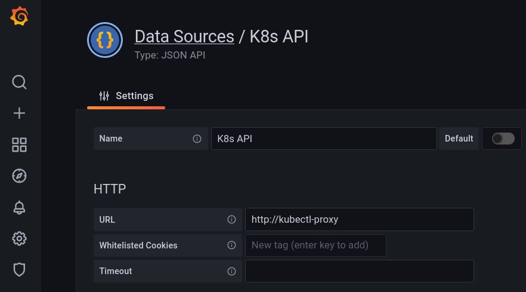
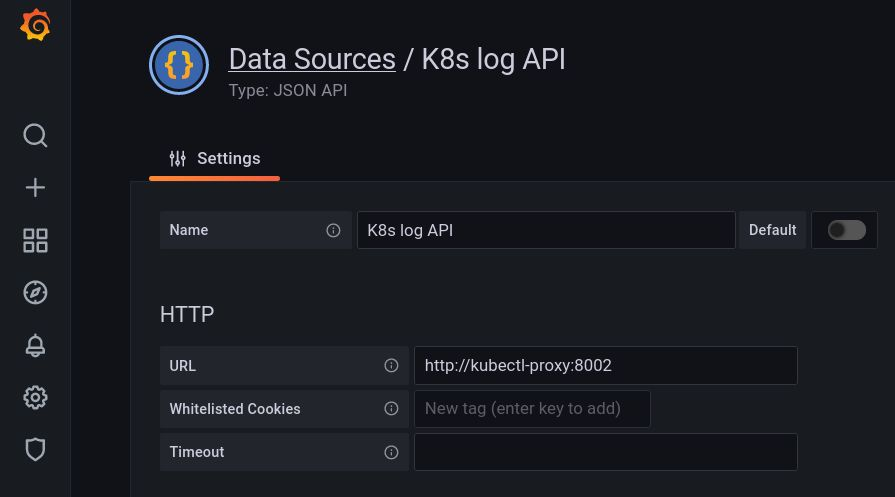
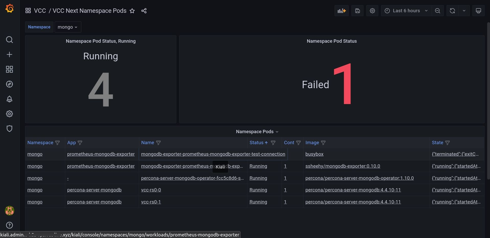
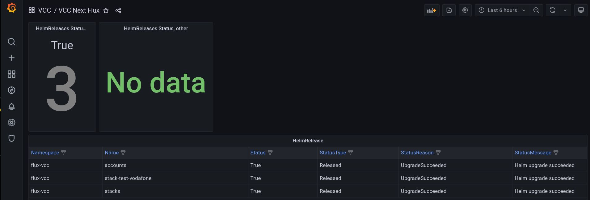
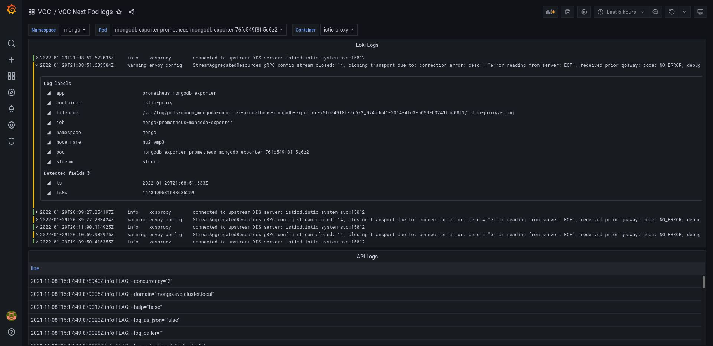

# grafana-kubernetes

It's a collection of a few solution for Grafana - Kubernetes integration.

## Presenting info from Kubernetes API

It's possible to access the Kubernetes API trough <https://grafana.com/grafana/plugins/marcusolsson-json-datasource/>, but access token to Kubernetes API must be set in Grafana, which is not too secure.
Instead, a kubectl proxy can run in same namespace with read-only access, limited to a set of resources.

Grafana can present Loki logs, but if Loki (Promtail) is not deployed or Loki does not configured to collect logs from all Pods, Grafana can show Pod logs trough JSON API datasource, too. There is one trick: an nginx container transforms lines to JSON array by a simple script.

Table panel can have external link, which is configured on Pod listing panels to access an external Kubernetes dashboard.

The example setup looks like:

```text
     ┌──────────────────────────────────────────┐     ┌──────────────────────┐
     │                                          │     │                      │
     │                 Grafana                  │     │     Adapter Pod      │
     │                                          │     │                      │
     │   ┌──────────────┐    ┌──────────────┐   │     │   ┌──────────────┐   │     ┌──────────────┐
     │   │              │    │              │   │     │   │              │   │     │              │
     │   │  Pod info:   │    │   JSON API   │   │     │   │   kubectl    │   │     │  Kubernetes  │
     │   │ Table, Stat  │◄───┤   datasurce  │◄──┼─────┼───┤    proxy     │◄──┼─────┤     API      │
┌────┼───┤ panel plugin │    │    plugin    │   │     │   │              │   │     │              │
│    │   │              │  ┌─┤              │   │     │   │              │   │     │              │
│    │   └──────────────┘  │ └──────────────┘   │     │   └──────────────┘   │     └──────┬───────┘
│    │                     │                    │     │                      │            │
│    │   ┌──────────────┐  │ ┌──────────────┐   │     │   ┌──────────────┐   │            │
│    │   │              │◄─┘ │              │   │     │   │              │   │            │
│    │   │  Pod logs:   │    │   JSON API   │   │     │   │    nginx,    │   │            │
│    │   │    Table     │◄───┤   datasurce  │◄──┼─────┼───┤   lines to   │◄──┼────────────┘
│    │   │ panel plugin │    │    plugin    │   │     │   │     JSON     │   │
│    │   │              │    │              │   │     │   │              │   │
│    │   └──────────────┘    └──────────────┘   │     │   └──────────────┘   │
│    │           ▲                              │     │                      │
│    │           │                              │     └──────────────────────┘
│    │           │                              │
│    │           │                              │
│    │           │                              │
│    │           │                              │     ┌──────────────────────┐
│    │           │                              │     │                      │
│    │           │                              │     │      Loki Pod        │
│    │           │                              │     │                      │
│    │           │           ┌──────────────┐   │     │   ┌──────────────┐   │
│    │           │           │              │   │     │   │              │   │
│    │           │           │     Loki     │   │     │   │              │   │
│    │           └───────────┤   datasurce  │◄──┼─────┼───┤    Loki      │   │
│    │                       │    plugin    │   │     │   │              │   │
│    │                       │              │   │     │   │              │   │
│    │                       └──────────────┘   │     │   └──────────────┘   │
│    │                                          │     │                      │
│    └──────────────────────────────────────────┘     └──────────────────────┘
│
│
│                ┌──────────────┐
│                │              │
│     link to    │    Kiali     │
└───────────────►│   or other   │
                 │   dashboard  │
                 │              │
                 └──────────────┘
```

## Adapter Pod

Deployment files of Adapter Pod can be found in [kubernetes/monitoring](kubernetes/monitoring) directory. These files can be deployed by `kubectl apply -f` commands or can be integrated to a Kustomize or Helm deployment.

The `kubect proxy` is configured to deny any modification requests, see at `kubectl-proxy-deployment.yaml`. Other access limitations are configured in `kubectl-proxy-clusterRole.yaml`.

A simple LUA code transforms the raw log lines to JSON array, see `kubectl-proxy-openresty-config.yaml`.

## Datasource configuration

Example configurations:





## Sample Grafana Dashboards

Raw Kubernetes responses should be transformed to a flat JSON array, substituting the missing values. Fortunately, JSON API datasource supports JSONata. Example JSONata expression for transformation and substitution:

```jsonata
$map(items, function($v) {{"namespace": $v.metadata.namespace, "name": $v.metadata.name, "appName": $v.metadata.labels."app.kubernetes.io/name" ? $v.metadata.labels."app.kubernetes.io/name" : "-", "statusPhase": $v.status.phase, "containerCount": $count($v.spec.containers), "containerImage": $join($v.spec.containers[*].image, " "), "containerState": $v.status.containerStatuses ? $string($v.status.containerStatuses[*].state) : "-"}})
```

Importable Grafana Dashboard files can be found in [grafana/dashboards](grafana/dashboards) directory.

### Namespace and All Pods

Pod table panels are configured with external links, which uses the external server URL from a Dashboard variable. Example screenshot with link to Kiali Dashboard:



### Flux

Flux does not have maintained UI, but Grafana can be used to show the current state, for example:



### Logs

Example sceenshot:


